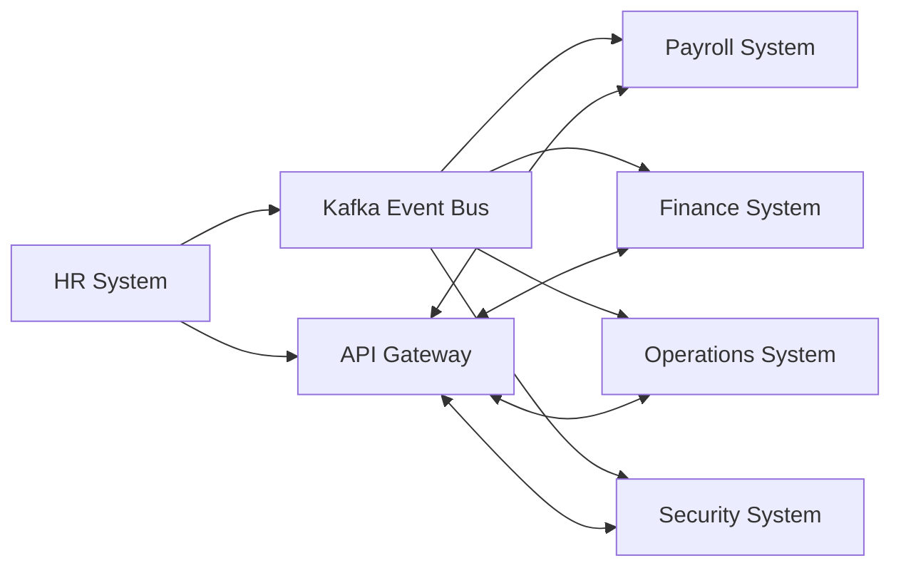
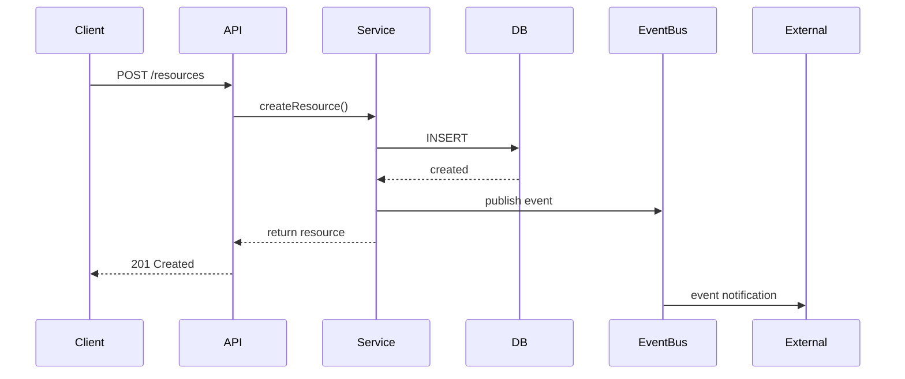

# HR System - Integration Guide

## Integration Architecture



## Integration Patterns

### Event-Driven Integration
- **Technology**: Apache Kafka
- **Latency**: < 100ms
- **Reliability**: At-least-once delivery
- **Use**: Real-time state changes

### Request-Response API
- **Technology**: REST + GraphQL
- **Latency**: < 500ms p95
- **Reliability**: Circuit breaker pattern
- **Use**: On-demand data retrieval

## System Dependencies

### Payroll System
- Bi-directional sync via Kafka events
- REST API for on-demand queries
- Shared authentication context

### Finance System
- Bi-directional sync via Kafka events
- REST API for on-demand queries
- Shared authentication context

### Operations System
- Bi-directional sync via Kafka events
- REST API for on-demand queries
- Shared authentication context

### Security System
- Bi-directional sync via Kafka events
- REST API for on-demand queries
- Shared authentication context


## API Contracts

### REST Endpoints

```typescript
// Authentication header required
Authorization: Bearer <jwt_token>

// Core operations
GET    /api/v1/resources
POST   /api/v1/resources
GET    /api/v1/resources/{id}
PUT    /api/v1/resources/{id}
PATCH  /api/v1/resources/{id}
DELETE /api/v1/resources/{id}
```

### Event Schemas

```json
{
  "eventId": "evt_<uuid>",
  "eventType": "ResourceCreated",
  "eventVersion": "1.0",
  "timestamp": "2026-02-11T09:00:00Z",
  "aggregateId": "res_<uuid>",
  "tenantId": "tenant_<uuid>",
  "userId": "user_<uuid>",
  "payload": {...}
}
```

## Data Flow



## Authentication & Authorization

- SSO via OAuth 2.0 + OIDC
- JWT access tokens (15 min expiry)
- RBAC with role-based permissions
- Tenant isolation at data layer

## Error Handling

```json
{
  "error": {
    "code": "RESOURCE_NOT_FOUND",
    "message": "Resource not found",
    "details": {},
    "timestamp": "2026-02-11T09:00:00Z",
    "requestId": "req_<uuid>"
  }
}
```

## Rate Limiting

- Default: 1000 requests/min per API key
- Authenticated: 5000 requests/min
- Headers: X-RateLimit-Limit, X-RateLimit-Remaining

## Monitoring

- API request latency (p50, p95, p99)
- Event processing lag
- Integration error rate
- Sync job success rate