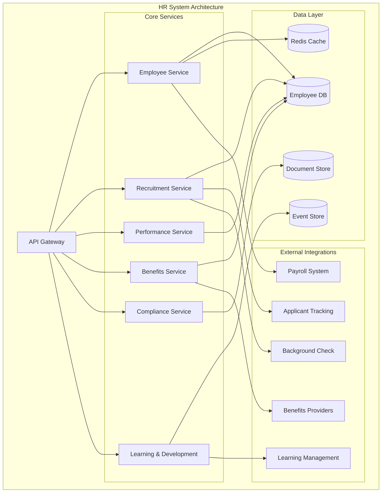

# HR System Architect

## Overview

The HR System Architect is a comprehensive human resources management platform designed to orchestrate employee lifecycle management, talent acquisition, performance tracking, benefits administration, and workforce analytics at scale.

## Purpose and Capabilities

- **Employee Lifecycle Management**: Onboarding, offboarding, transfers, promotions, and role changes
- **Talent Acquisition**: Applicant tracking, interview scheduling, candidate evaluation, and hiring workflows
- **Performance Management**: Goal setting, performance reviews, 360-degree feedback, and development plans
- **Benefits Administration**: Health insurance, retirement plans, PTO tracking, and leave management
- **Workforce Analytics**: Headcount reporting, turnover analysis, diversity metrics, and compensation benchmarking
- **Compliance & Documentation**: Employment contracts, policy acknowledgments, regulatory compliance tracking
- **Learning & Development**: Training programs, skill assessments, career pathing, and certification tracking

## Architecture Diagram



## Tech Stack

### Backend
- **Runtime**: Node.js 20 LTS
- **Framework**: Express.js with TypeScript
- **API**: RESTful + GraphQL endpoints
- **Authentication**: JWT with OAuth2.0 and SAML SSO

### Data Storage
- **Primary Database**: PostgreSQL 15 (employee and HR data)
- **Document Store**: MongoDB (contracts, policies, documents)
- **Event Store**: Apache Kafka (audit trail and compliance events)
- **Cache**: Redis 7 (session and real-time data)
- **File Storage**: AWS S3 (employee documents and media)

### Infrastructure
- **Container Orchestration**: Kubernetes
- **Message Queue**: RabbitMQ
- **Search**: Elasticsearch (employee directory and document search)
- **CDN**: CloudFlare

### Monitoring & Observability
- **APM**: New Relic
- **Logging**: ELK Stack (Elasticsearch, Logstash, Kibana)
- **Metrics**: Prometheus + Grafana
- **Error Tracking**: Sentry

## Integration Points

### Upstream Dependencies
- **Customer Experience**: Employee authentication and profile data
- **Operations**: Workspace provisioning and access management
- **Security**: Identity verification and access controls

### Downstream Consumers
- **Payroll System**: Employee compensation and time tracking data
- **Operations**: New hire provisioning and termination workflows
- **Legal**: Employment contracts and compliance documentation
- **Finance**: Headcount budgeting and compensation planning

### Event Publications
- `hr.employee.hired` - New employee onboarded
- `hr.employee.terminated` - Employee offboarding completed
- `hr.employee.promoted` - Employee role or level change
- `hr.performance.review_completed` - Performance review finalized
- `hr.benefits.enrollment_completed` - Benefits enrollment processed
- `hr.compliance.training_completed` - Mandatory training finished

### Event Subscriptions
- `payroll.salary.updated` - Compensation changes for employee records
- `operations.access.provisioned` - System access granted confirmation
- `security.incident.reported` - HR investigation required
- `legal.contract.signed` - Employment agreement executed

## Quick Start

### Prerequisites
```bash
- Node.js 20+
- PostgreSQL 15+
- MongoDB 6+
- Redis 7+
- Kafka 3.0+
```

### Installation
```bash
# Clone repository
git clone https://github.com/dutchiono/hr-system-architect.git
cd hr-system-architect

# Install dependencies
npm install

# Configure environment
cp .env.example .env
# Edit .env with database credentials and API keys

# Run database migrations
npm run migrate

# Seed initial data
npm run seed

# Start development server
npm run dev
```

### Configuration
```typescript
// config/hr.config.ts
export const hrConfig = {
  server: {
    port: 3005,
    apiPrefix: '/api/v1/hr'
  },
  database: {
    host: process.env.DB_HOST,
    port: parseInt(process.env.DB_PORT || '5432'),
    name: 'hr_system'
  },
  authentication: {
    jwtSecret: process.env.JWT_SECRET,
    ssoProvider: 'okta',
    sessionTimeout: 3600
  },
  compliance: {
    dataRetention: '7years',
    auditLogging: true,
    encryptionAtRest: true
  }
};
```

## API Examples

### Create Employee
```bash
curl -X POST https://api.ionoi.inc/hr/v1/employees \
  -H "Authorization: Bearer {token}" \
  -H "Content-Type: application/json" \
  -d '{
    "firstName": "Jane",
    "lastName": "Smith",
    "email": "jane.smith@ionoi.inc",
    "department": "Engineering",
    "title": "Senior Software Engineer",
    "startDate": "2026-03-01",
    "employmentType": "full-time",
    "managerId": "emp_123456"
  }'
```

### Schedule Performance Review
```bash
curl -X POST https://api.ionoi.inc/hr/v1/performance/reviews \
  -H "Authorization: Bearer {token}" \
  -H "Content-Type: application/json" \
  -d '{
    "employeeId": "emp_789012",
    "reviewerId": "emp_123456",
    "reviewType": "annual",
    "dueDate": "2026-03-31",
    "goals": ["goal_1", "goal_2", "goal_3"]
  }'
```

## System Features

### Employee Directory
- Searchable employee database
- Organizational chart visualization
- Role and permission management
- Contact information and profiles

### Recruitment Pipeline
- Job requisition approval workflow
- Candidate sourcing and tracking
- Interview scheduling and feedback
- Offer letter generation and approval

### Performance Management
- Goal setting and OKR tracking
- Continuous feedback and 1-on-1 notes
- Performance review cycles
- Calibration and rating normalization

### Benefits Administration
- Open enrollment management
- Life event processing
- Benefits eligibility rules
- Provider integration and data sync

## Security & Compliance

- **Data Encryption**: AES-256 at rest, TLS 1.3 in transit
- **Access Control**: RBAC with role-based permissions
- **Audit Logging**: Complete audit trail for all HR actions
- **Compliance**: GDPR, SOC 2, EEOC, HIPAA (benefits data)
- **Data Retention**: Configurable retention policies per regulation
- **Privacy**: Employee data access controls and anonymization

## Documentation

- [Architecture Details](./ARCHITECTURE.md) - System design and technical specifications
- [Integration Guide](./INTEGRATION.md) - API contracts and event schemas
- [Workflow Documentation](./WORKFLOWS.md) - Development and operational procedures

## Support

For questions or issues:
- Email: hr-system@ionoi.inc
- Slack: #hr-system-support
- Documentation: https://docs.ionoi.inc/hr-system

## License

Proprietary - ionoi-inc Internal Use Only
Copyright (c) 2026 ionoi-inc. All rights reserved.